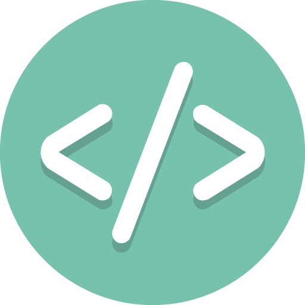

<h3>
  
  Практические задачи:
</h3>

---
1. Функция проверки палиндрома?
2. Функция поиска самого короткого слова?
3. Функция создания инициалов?
4. Функция суммирования всех цифр числа?
5. Функция поиска минимального и максимального значений в массиве?
6. Функция создания набора дубликатов символов строки?
7. Функция возврата индексов заглавных букв строки?
8. Функция вывода чисел от 1 до n (n - передаваемый аргумент)
9. Функция возврата уникальных значений из нескольких массивов?
10. Функция форматирования цифр в телефонный номер?
11. Функция поиска гласных букв в строке?
12. Функция трансформации букв в заглавный регистр?
---
